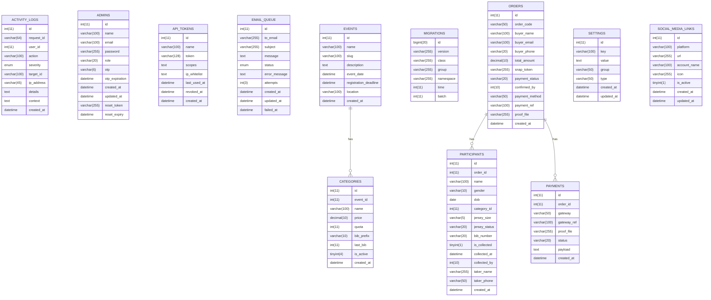

# Entity Relationship Diagram (Auto-Generated)

Generated at: 2026-01-11 23:53:09

```mermaid
erDiagram
    ACTIVITY_LOGS {
        int(11) id
        varchar(64) request_id
        int(11) user_id
        varchar(100) action
        enum severity
        varchar(100) target_id
        varchar(45) ip_address
        text details
        text context
        datetime created_at
    }
    ADMINS {
        int(11) id
        varchar(100) name
        varchar(100) email
        varchar(255) password
        varchar(20) role
        varchar(6) otp
        datetime otp_expiration
        datetime created_at
        datetime updated_at
        varchar(255) reset_token
        datetime reset_expiry
    }
    API_TOKENS {
        int(11) id
        varchar(100) name
        varchar(128) token
        text scopes
        text ip_whitelist
        datetime last_used_at
        datetime revoked_at
        datetime created_at
    }
    CATEGORIES {
        int(11) id
        int(11) event_id
        varchar(100) name
        decimal(10) price
        int(11) quota
        varchar(10) bib_prefix
        int(11) last_bib
        tinyint(4) is_active
        datetime created_at
    }
    EMAIL_QUEUE {
        int(11) id
        varchar(255) to_email
        varchar(255) subject
        text message
        enum status
        text error_message
        int(3) attempts
        datetime created_at
        datetime updated_at
        datetime failed_at
    }
    EVENTS {
        int(11) id
        varchar(100) name
        varchar(100) slug
        text description
        datetime event_date
        datetime registration_deadline
        varchar(100) location
        datetime created_at
    }
    MIGRATIONS {
        bigint(20) id
        varchar(255) version
        varchar(255) class
        varchar(255) group
        varchar(255) namespace
        int(11) time
        int(11) batch
    }
    ORDERS {
        int(11) id
        varchar(50) order_code
        varchar(100) buyer_name
        varchar(100) buyer_email
        varchar(20) buyer_phone
        decimal(10) total_amount
        varchar(255) snap_token
        varchar(20) payment_status
        int(10) confirmed_by
        varchar(50) payment_method
        varchar(100) payment_ref
        varchar(255) proof_file
        datetime created_at
    }
    PARTICIPANTS {
        int(11) id
        int(11) order_id
        varchar(100) name
        varchar(10) gender
        date dob
        int(11) category_id
        varchar(5) jersey_size
        varchar(20) jersey_status
        varchar(20) bib_number
        tinyint(1) is_collected
        datetime collected_at
        int(10) collected_by
        varchar(255) taker_name
        varchar(50) taker_phone
        datetime created_at
    }
    PAYMENTS {
        int(11) id
        int(11) order_id
        varchar(50) gateway
        varchar(100) gateway_ref
        varchar(255) proof_file
        varchar(20) status
        text payload
        datetime created_at
    }
    SETTINGS {
        int(11) id
        varchar(100) key
        text value
        varchar(50) group
        varchar(50) type
        datetime created_at
        datetime updated_at
    }
    SOCIAL_MEDIA_LINKS {
        int(11) id
        varchar(100) platform
        varchar(255) url
        varchar(100) account_name
        varchar(255) icon
        tinyint(1) is_active
        datetime created_at
        datetime updated_at
    }
    EVENTS ||--o{ CATEGORIES : "has"
    ORDERS ||--o{ PARTICIPANTS : "has"
    ORDERS ||--o{ PAYMENTS : "has"
```
