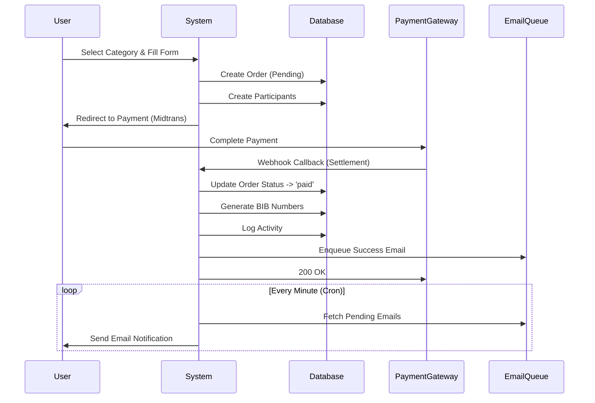

# Checkout Flow

```mermaid
sequenceDiagram
    participant User
    participant System
    participant Database
    participant PaymentGateway
    participant EmailQueue

    User->>System: Select Category & Fill Form
    System->>Database: Create Order (Pending)
    System->>Database: Create Participants
    System->>User: Redirect to Payment (Midtrans)

    User->>PaymentGateway: Complete Payment
    PaymentGateway->>System: Webhook Callback (Settlement)

    System->>Database: Update Order Status -> 'paid'
    System->>Database: Generate BIB Numbers
    System->>Database: Log Activity
    System->>EmailQueue: Enqueue Success Email

    System->>PaymentGateway: 200 OK

    loop Every Minute (Cron)
        System->>EmailQueue: Fetch Pending Emails
        System->>User: Send Email Notification
    end
```
